### Discover APIs from Axway API Manager (V7) and configure custom approval flows


The basic use case is as follows:

**API Provider**
* Will publish APIs from **Axway API Manager** into the AMPLIFY Unified Catalog via the agents.  Those APIs will require manual approval of subscription requests from consumers.
* Is notified in Microsoft Teams when there is a new subscription requests, and will approve or reject the request. 

**API Consumer**
* Discovers the API in the Unified Catalog and request access by subscribing.
* On approval, a subscription key will be created in **Axway API Manager** by the agent and the keys will be sent to the API Consumer's email. 
After the key has been sent, the state of the Subscription in Unified Catalog gets updated by the agent to Active and the Consumer can now use the API with the keys that were received over email. 
* Can cancel the subscription from the Unified Catalog. When cancelled, the subscription in Axway API Manager will be removed and the state of the Unified Catalog subscription will be updated to unsubscribed, indicating the consumer will no longer be able to use the API. 
 
The technologies that were used for this project: 
* [API Manager agents](https://docs.axway.com/bundle/axway-open-docs/page/docs/central/connect-api-manager/index.html)
to discover the APIs and publish them to Unified AMPLIFY Unified Catalog
* [AMPLIFY Unified Catalog](https://docs.axway.com/bundle/axway-open-docs/page/docs/catalog/index.html) as the central place to publish and discover the APIs.   
* [Microsoft Teams](https://www.microsoft.com/en-us/microsoft-365/microsoft-teams) for notifications and approval or rejection of subscription requests. 

Follow the steps below to use this example: 

### Prerequisites: Configure the Axway V7 agent to discover and publish the APIs from Axway API Manager
Documentation available [here](https://docs.axway.com/bundle/axway-open-docs/page/docs/central/connect-api-manager/filtering-apis-to-be-discovered/index.html)

### Step 1: Create Amplify Central Service Account

Save the **clientId** and **clientSecret** from the response which will be used in Integration Builder flow.

##### Option 1 - using amplify cli and jq

Install [Amplify Central CLI](https://docs.axway.com/bundle/axway-open-docs/page/docs/central/cli_central/cli_install/index.html)
Install [jq](https://stedolan.github.io/jq/download/)

Make sure you log out from all active sessions. 


```powershell
amplify auth logout --all
```

Go to the AMPLIFY platform, login with an account that is assigned the Administrator platform role, and copy the OrgID. 
The OrgID (Organization ID) can be obtained by visiting: [https://platform.axway.com/#/org](https://platform.axway.com/#/org).

Set the **ORG_ID** in the command below and execute it. 
 
```sh
amplify auth login --client-id apicentral
ORG_ID=<org_id_value> && TOKEN=$(amplify auth list --json | jq -r ".[] | select( .org.org_id == $ORG_ID ) | .tokens.access_token") && curl -vv 'https://apicentral.axway.com/api/v1/serviceAccounts' \
--header "Authorization: Bearer ${TOKEN}" \
--header "X-Axway-Tenant-Id: ${ORG_ID}" \
--header 'Content-Type: application/json' \
--data-raw '{
  "serviceAccountType": "DOSA",
  "serviceAccountName": "catalog-integration",
  "clientAuthType": "SECRET"
}'
```

##### Option 2 - using postman collection

Use the postman **[collection](https://github.com/Axway/unified-catalog-integrations/blob/axwayTokenFromSA/utils/postman)**. 

1. Import the [Manage service accounts.postman_collection.json](https://github.com/Axway/unified-catalog-integrations/blob/axwayTokenFromSA/utils/postman/Manage%20service%20accounts.postman_collection.json) collection in Postman. 

2. Import the [AMPLIFY Environment configuration file](https://github.com/Axway/unified-catalog-integrations/blob/axwayTokenFromSA/utils/postman/AMPLIFY%20Central%20Production.postman_environment.json) in Postman. 

3. For authentication, the APIs require OAuth2 implicit. To authenticate, go to Postman Collection, click on the "..." button and then select _Edit_. 

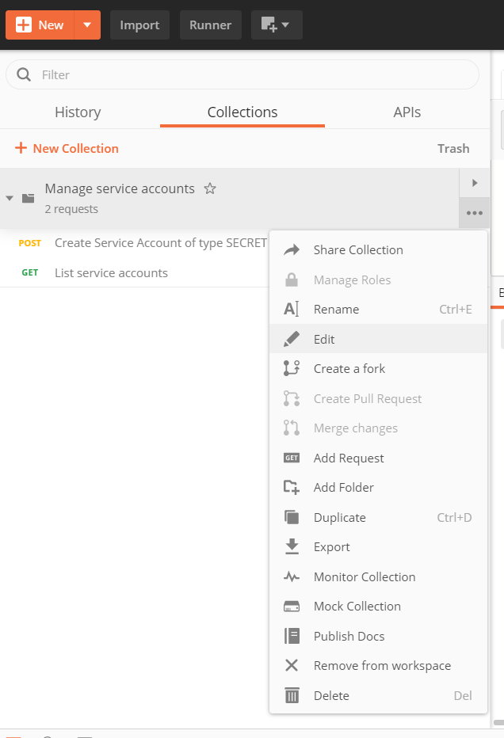 
 
4. From the new screen, go to _Authorization_ and click on _Get New Access Token_. To authenticate use: 
* Grant Type: `Implicit`
* Auth URL:`https://login.axway.com/auth/realms/Broker/protocol/openid-connect/auth?idpHint=360`
* Client ID: `apicentral`

 

Copy the access token. You will use this to set the AMPLIFY Central Production environment variables. 

5. Set the AMPLIFY Central Production environment variables. From the top right corner, select the _AMPLIFY Central Production_ environment from the dropdown, and then click on the eye button next to the dropdown. 
* Set the CURRENT VALUE for the **org_id**: Go to the AMPLIFY platform, login with an account that is assinged the Administrator platform role, and copy the OrgID. 
* Set the CURRENT VALUE for the **auth_token**: Copy and paste the access token from the previous step.  

 


6. Run the **Create Service Account of type SECRET** POST request. In the body payload, you could change the `serviceAccountName` to a value of your choice. 

 

Save the **clientId** and **clientSecret** from the response which will be used in Integration Builder flow. Below is an example of the response body. 

```json
{
  "name": "amplify-integration",
  "type": "DOSA",
  "clientId": "DOSA_f0c4b70**********",
  "clientAuthType": "SECRET",
  "clientSecret": "07b*************",
  "registrationToken": "eyJhbGciOiJIUzI1NiIsInR5cCIgOiAiSldUIiwia2lkIiA6ICI3NjE5OGUwZS1lNTcz******",
  "tokenUrl": "https://login.axway.com/auth/realms/Broker/protocol/openid-connect/token",
  "aud": "https://login.axway.com/auth",
  "realm": "Broker",
  "certificate": {},
  "metadata": {
    "createTimestamp": "2020-07-01T20:24:02.059Z",
    "createUserId": "e1add099-59da-40b6-b13f-912bfa816697",
    "modifyTimestamp": "2020-07-01T20:24:02.059Z",
    "modifyUserId": "e1add099-59da-40b6-b13f-912bfa816697"
  }
}
```

### Step 2: Configure Microsoft Teams flow to Approve / Reject subscription requests
***

**AMPLIFY Central Unified Catalog** has the option to configure Webhooks that can be invoked when Consumers of Catalog asset update their subscriptions.This flow will send notifications to MS teams channel as an Active card when a consumer subscribes to the API from the Unified Catalog. The API provider can then approve or reject the subscription requests from within the MS Active card. This action will trigger the Integration Builder flow, as a post execution step. 
The MS flow will also post notifications in the channel for any subscription updates. 

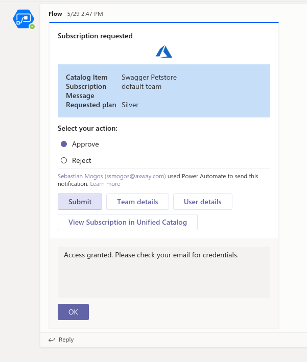

**Pre-requisite:** 
* You'll need [Microsoft Flow](https://flow.microsoft.com), with a Free Trial account at a minimum to be able to create the flow. 

**To configure the flow:**

#### 1. Navigate to [Microsoft Flow](https://flow.microsoft.com).
#### 2. Create the Webhook entry point that Unified Catalog will send the events to.

* Go to "My flows". 
* Create an `Instant flow`, provide a `name` and select `When an HTTP request is received` as an entry point.
* In the request json body schema, copy and paste the Subscription Updated Event schema below: 

```json
{
        "type": "object",
        "properties": {
            "id": {
                "type": "string"
            },
            "time": {
                "type": "string"
            },
            "version": {
                "type": "string"
            },
            "product": {
                "type": "string"
            },
            "correlationId": {
                "type": "string"
            },
            "organization": {
                "type": "object",
                "properties": {
                    "id": {
                        "type": "string"
                    }
                }
            },
            "type": {
                "type": "string"
            },
            "payload": {
                "type": "object",
                "properties": {
                    "consumerInstance": {
                        "type": "object",
                        "properties": {
                            "kind": {
                                "type": "string"
                            },
                            "name": {
                                "type": "string"
                            },
                            "tags": {
                                "type": "array",
                                "items": {
                                    "type": "string"
                                }
                            },
                            "group": {
                                "type": "string"
                            },
                            "metadata": {
                                "type": "object",
                                "properties": {
                                    "id": {
                                        "type": "string"
                                    },
                                    "audit": {
                                        "type": "object",
                                        "properties": {
                                            "createUserId": {
                                                "type": "string"
                                            },
                                            "modifyUserId": {
                                                "type": "string"
                                            },
                                            "createTimestamp": {
                                                "type": "string"
                                            },
                                            "modifyTimestamp": {
                                                "type": "string"
                                            }
                                        }
                                    },
                                    "scope": {
                                        "type": "object",
                                        "properties": {
                                            "id": {
                                                "type": "string"
                                            },
                                            "kind": {
                                                "type": "string"
                                            },
                                            "name": {
                                                "type": "string"
                                            }
                                        }
                                    },
                                    "references": {
                                        "type": "array",
                                        "items": {
                                            "type": "object",
                                            "properties": {
                                                "id": {
                                                    "type": "string"
                                                },
                                                "kind": {
                                                    "type": "string"
                                                },
                                                "name": {
                                                    "type": "string"
                                                },
                                                "type": {
                                                    "type": "string"
                                                }
                                            },
                                            "required": [
                                                "id",
                                                "kind",
                                                "name",
                                                "type"
                                            ]
                                        }
                                    },
                                    "resourceVersion": {
                                        "type": "string"
                                    }
                                }
                            },
                            "apiVersion": {
                                "type": "string"
                            },
                            "attributes": {
                                "type": "object",
                                "properties": {
                                    "release": {
                                        "type": "string"
                                    }
                                }
                            }
                        }
                    },
                    "subscription": {
                        "type": "object",
                        "properties": {
                            "id": {
                                "type": "string"
                            },
                            "name": {
                                "type": "string"
                            },
                            "userId": {
                                "type": "string"
                            },
                            "properties": {
                                "type": "object",
                                "additionalProperties": true
                            },
                            "metadata": {
                                "type": "object",
                                "properties": {
                                    "createUserId": {
                                        "type": "string"
                                    }
                                }
                            },
                            "currentState": {
                                "type": "string"
                            },
                            "owningTeamId": {
                                "type": "string"
                            },
                            "relationships": {
                                "type": "array",
                                "items": {
                                    "type": "object",
                                    "properties": {
                                        "key": {
                                            "type": "string"
                                        },
                                        "path": {
                                            "type": "string"
                                        },
                                        "spec": {
                                            "type": "string"
                                        },
                                        "type": {
                                            "type": "string"
                                        },
                                        "value": {
                                            "type": "string"
                                        }
                                    },
                                    "required": [
                                        "key",
                                        "path",
                                        "spec",
                                        "type",
                                        "value"
                                    ]
                                }
                            },
                            "nextPossibleStates": {
                                "type": "array"
                            },
                            "currentStateDescription": {
                                "type": "string"
                            }
                        }
                    },
                    "catalogItem": {
                        "type": "object",
                        "properties": {
                            "id": {
                                "type": "string"
                            },
                            "name": {
                                "type": "string"
                            },
                            "owningTeamId": {
                                "type": "string"
                            },
                            "relationships": {
                                "type": "array",
                                "items": {
                                    "type": "object",
                                    "properties": {
                                        "key": {
                                            "type": "string"
                                        },
                                        "path": {
                                            "type": "string"
                                        },
                                        "spec": {
                                            "type": "string"
                                        },
                                        "type": {
                                            "type": "string"
                                        },
                                        "value": {
                                            "type": "string"
                                        }
                                    },
                                    "required": [
                                        "key",
                                        "path",
                                        "spec",
                                        "type",
                                        "value"
                                    ]
                                }
                            }
                        }
                    }
                }
            }
        }
    }
```


#### 3. Add an extra step of type `Control`, action type `Condition`. 
   * Set the the value for the `Condition`, by searching `currentState` using the `Add dynamic content`. 
   * Set the operator to `is equal to` and value set to `REQUESTED`.
   

#### 4. Set up the Adaptive card. The subscription requests will be Approved or Rejected based on the response of the action in the Adaptive Card. 
   * On the `If yes` branch, select `Add a new action` of type `Post an Adaptive Card to a Teams channel and wait for the response`.
   * Configure the `Team` and the `Channel` where the card would be posted.
   * Copy-paste the text below in `Message` box: 

 ```json
    {
        "$schema": "http://adaptivecards.io/schemas/adaptive-card.json",
        "type": "AdaptiveCard",
        "version": "1.0",
        "body": [
            {
                "type": "Container",
                "items": [
                    
                    {
                        "type": "TextBlock",
                        "text": "Subscription requested",
                        "weight": "Bolder",
                        "size": "Medium"
                    },
                    {
                        "type":"Image",
                        "url":"https://blog.axway.com/wp-content/uploads/2015/03/Screenshot1.pngaxway.png",
                        "spacing": "Small",
                        "horizontalAlignment": "Center",
                        "height": "stretch",
                        "size": "Medium"
                    }
                ]
            },
            {
                "type": "Container",
                "style": "accent",
                "items": [
                    {
                        "type": "FactSet",
                        "facts": [
                            {
                                "title": "Catalog Item",
                                "value": "@{triggerBody()?['payload']?['catalogItem']?['name']}"
                            },
                            {
                                "title": "Subscription",
                                "value": "@{triggerBody()?['payload']?['subscription']?['name']}"
                            },
                            {
                                "title": "Message",
                                "value": "@{triggerBody()?['payload']?['subscription']?['currentStateDescription']}"
                            }
                        ]
                    }
                ]
            },
            {
                "type": "TextBlock",
                "text": "Select your action:",
                "weight": "Bolder",
                "wrap": true
            },
            {
                "type": "Input.ChoiceSet",
                "placeholder": "Enter your action",
                "id": "action",
                "choices": [
                    {
                        "title": "Approve",
                        "value": "approved"
                    },
                    {
                        "title": "Reject",
                        "value": "rejected"
                    }
                ],
                "style": "expanded"
            }
        ],
        "actions": [
            {
                "type": "Action.ShowCard",
                "title": "Submit",
                "card": {
                    "type": "AdaptiveCard",
                    "body": [
                        {
                            "type": "Input.Text",
                            "id": "comment",
                            "isMultiline": true,
                            "placeholder": "Enter your comment"
                        }
                    ],
                    "actions": [
                        {
                            "type": "Action.Submit",
                            "title": "OK"
                        }
                    ],
                    "$schema": "http://adaptivecards.io/schemas/adaptive-card.json"
                }
            },
            {
                "type": "Action.OpenUrl",
                "title": "Team details",
                "url": "https://apicentral.axway.com/access/teams/detail/@{triggerBody()?['payload']?['subscription']?['owningTeamId']}"
            },
            {
                "type": "Action.OpenUrl",
                "title": "User details",
                "url": "https://platform.axway.com/#/user/@{triggerBody()?['payload']?['subscription']?['metadata']?['createUserId']}"
            },
            {
                "type": "Action.OpenUrl",
                "title": "View Subscription in Unified Catalog",
                "url": "https://apicentral.axway.com/catalog/@{triggerBody()?['payload']?['catalogItem']?['id']}/subscriptions/@{triggerBody()?['payload']?['subscription']?['id']}"
            }
        ],
        "minHeight": "100px"
    }
 ```

   * Set the `Update Message` to: 
 ```
Subscription "@{triggerBody()?['payload']?['subscription']?['name']}" processed for "@{triggerBody()?['payload']?['catalogItem']?['name']}"
```
   * Set the `Should update card` to `yes`.

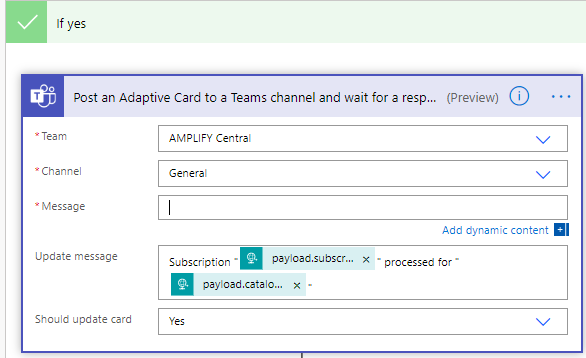

For easier access to the Adaptive card data, rename it to *card*.
On the top right corner of the card, click the ellipsis (...), then pick *Rename* to *card*.
 
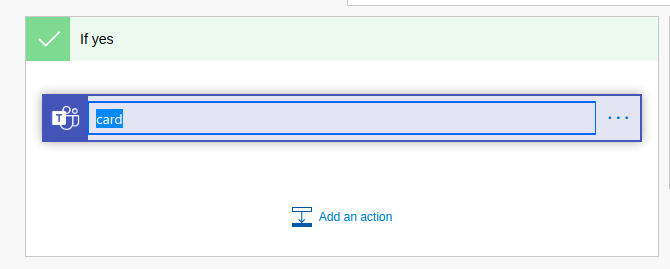
 

#### 5. Get a Bearer token from platform using the **clientId** and **clientSecret** from **Step 1**


Add an action of type `HTTP` to configure doing REST API Calls to AMPLIFY Central.

   * Set `Method`to `POST`
   * Set `URI`to `https://login.axway.com/auth/realms/Broker/protocol/openid-connect/token` 
   * Add a `Header` with key `Content-Type` and value `application/x-www-form-urlencoded`
   * Set the `Body`to `grant_type=client_credentials` 
   * Click on `Show advanced options` and set `Authentication` to `Basic`. 
   For username, set the value of the **clientId**
   For password, set the value of the **clientSecret**
   * Rename the action to GetToken
   
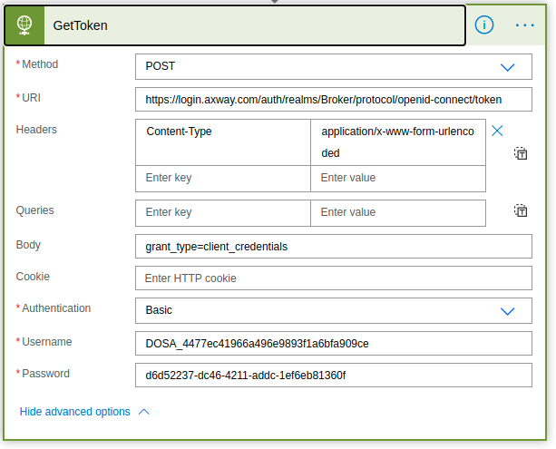


#### 6. Add a `Control` action of type `Switch` to check the response of the `GetToken` http call
Click on the `On` input and on the `Add dynamic content` link. Select `Status code` from the `GetToken` action.
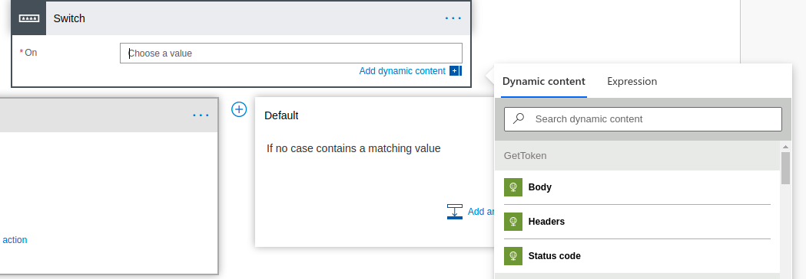
Click on the ellipsis (...) of the Switch action and select *Configure run after*. 
Pick all options beside `is skipped`: 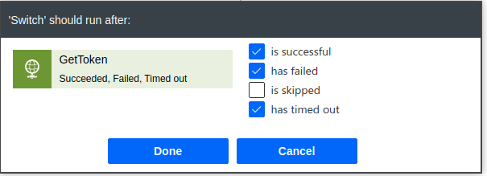

On the right side, for the Default behaviour, is where we will treat the error. 
For this, we will just fail the formula execution, but it can be configured to post back to the channel to inform the 
user that its operation could not be executed or/and to also inform the team that manages the flow that it failed executing.
We'll pick a *Control* *Terminate* action. 
Configure it to set the `Status` as `Failed` and the `Message` as `Could not get Platform token. Http call failed with code: @{outputs('GetToken')['statusCode']}`
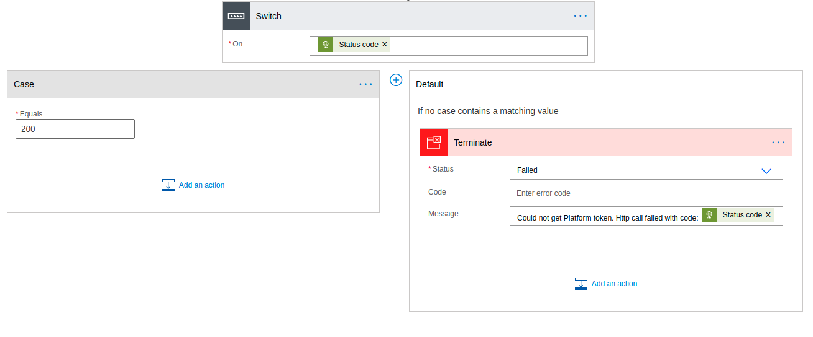


On the left side `Case` on the `Equals` input set the value of `200`.

Next we need to check if the Subscription still exists (as it might have been updated until the Card has been actioned in MS Teams).

Add an action of type `HTTP`
   * Set `Method`to `GET`
   * Set `URI`to `https://apicentral.axway.com/api/unifiedCatalog/v1/catalogItems/@{triggerBody()?['payload']?['catalogItem']?['id']}/subscriptions/@{triggerBody()?['payload']?['subscription']?['id']}` 
   * Add a `Header` with key `Content-Type` and value `application/json` and another one with `Accept` key and value `application/json`
   * Click on `Show advanced options` and set `Authentication` to `Raw` and for value `Bearer @{body('GetToken')?['access_token']}`
   * Rename the action to CheckSubscription
   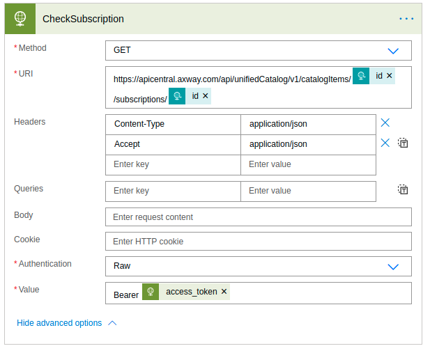

#### 7. Now similar to `GetToken`, we need to take care of the errors. So we'll add a new action of type `Switch`

For `On` value, we pick the status code for the `CheckSubscription` step.


Update the switch step so it runs for errors in the `CheckSubscription` spec.
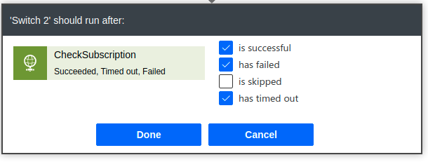

We now have to check if the catalog item or subscriptions are not present in Amplify Central, so we check if the call return 404.
On the 404, we will send an update to the same teams channel that the data is not there anymore.

Create a `Post a message as the Flow bot to a channel` and set the message to:
`Subscription "@{triggerBody()?['payload']?['subscription']?['name']}" for catalog item "@{triggerBody()?['payload']?['catalogItem']?['name']}" does not exist anymore.`

On the `Default` case we will fail the execution as in the previous step.
Message: `Subscription "@{triggerBody()?['payload']?['subscription']?['name']}" for catalog item "@{triggerBody()?['payload']?['catalogItem']?['name']}" does not exist anymore.`


#### 8. Update the subscription state
On the `200` branch for the last Switch, we will try to update the subscription to the new state: APPROVED or REJECTED.

Create an HTTP action with:
   * Set `Method`to `POST`
   * Set `URI`to `https://apicentral.axway.com/api/unifiedCatalog/v1/catalogItems/@{triggerBody()?['payload']?['catalogItem']?['id']}/subscriptions/@{triggerBody()?['payload']?['subscription']?['id']}/states` 
   * Add a `Header` with key `Content-Type` and value `application/json` and another one with `Accept` key and value `application/json`
   * Add a body with:
   `
   {
     "state": "@{if(equals(body('card').data.action,'approved'), 'APPROVED','REJECTED')}",
     "description": "@{body('card')?['data']?['comment']}"
   }
   `
   * Click on `Show advanced options` and set `Authentication` to `Raw` and for value `Bearer @{body('GetToken')?['access_token']}`
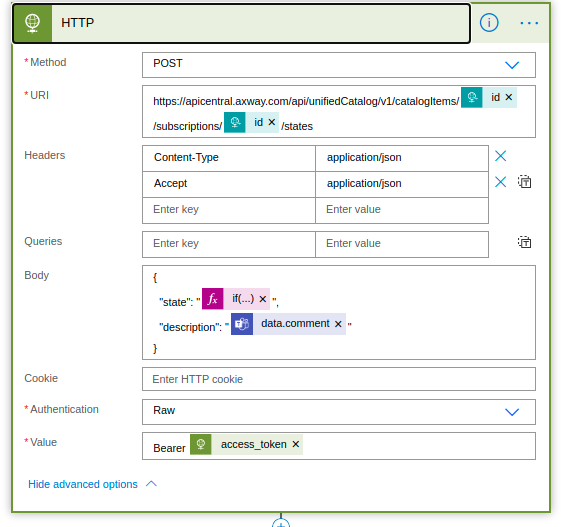

Add a action of type `Switch` to check the response and handle the errors (set it to run for after HTTP post Errors as well).

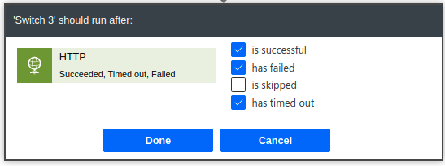

For `201`, we send back a teams channel notification that the operation was executed.

Create a `Post a message as the Flow bot to a channel` action with message: `Subscription "@{triggerBody()?['payload']?['subscription']?['name']}" for catalog item "@{triggerBody()?['payload']?['catalogItem']?['name']}" was "@{if(equals(body('card').data.action,'approved'), 'APPROVED','REJECTED')}"`
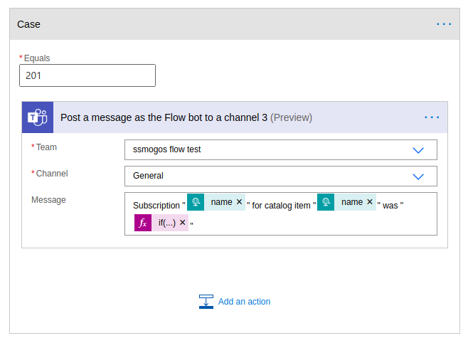


For `400`, we notify that the subscription state has been changed from REQUESTED since the card was posted. 

Create a `Post a message as the Flow bot to a channel` action with message that includes the current state of the subscription:

`Subscription "@{triggerBody()?['payload']?['subscription']?['name']}" for catalog item "@{triggerBody()?['payload']?['catalogItem']?['name']}" was not "@{if(equals(body('card').data.action,'approved'), 'APPROVED','REJECTED')}" as it was already in @{body('CheckSubscription')?['state']} state` 

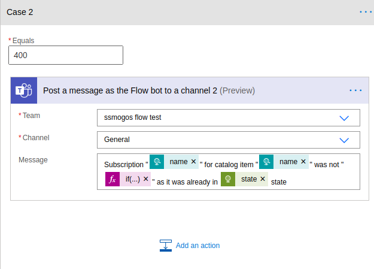

For Default `Switch` branch, we will add a `Terminate` action with `Subscription "@{triggerBody()?['payload']?['subscription']?['name']}" state for catalog item "@{triggerBody()?['payload']?['catalogItem']?['name']}" was not updated. Received status code @{outputs('HTTP')['statusCode']}"`

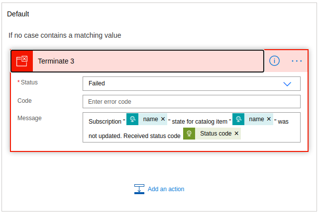


Combining the above cases, the update subscription switch should have those conditions now:


#### 9. Post on Microsoft Teams all subscription state changes

If the provider also wants to track subscription state changes in its Microsoft Teams channel, then on the top `If no` 
branch on the main top `Condition` set after the trigger, an extra action can be added.

Top `if no` branch:

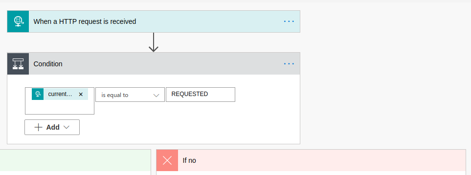

Add a new action as `Post a message as a Flow bot to a channel` with `Message` set to `Subscription ["@{triggerBody()?['payload']?['subscription']?['name']}"](https://apicentral.axway.com/catalog/@{triggerBody()?['payload']?['catalogItem']?['id']}/subscriptions/@{triggerBody()?['payload']?['subscription']?['id']}) for catalog item ["@{triggerBody()?['payload']?['catalogItem']?['name']}"](https://apicentral.axway.com/catalog/@{triggerBody()?['payload']?['catalogItem']?['id']}) state changed to @{triggerBody()?['payload']?['subscription']?['currentState']}`

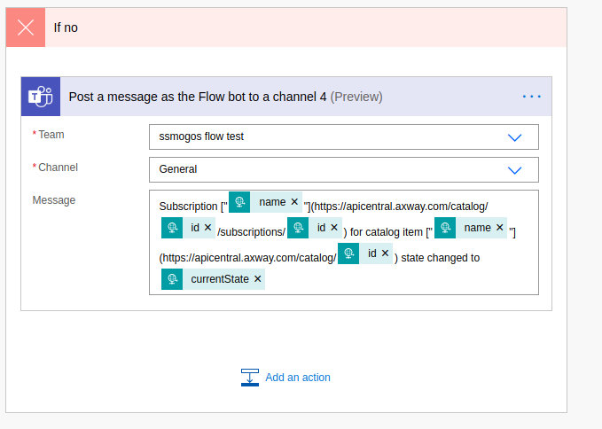

Now provides will get all the subscriptions state changes updates besides of REQUESTED for which they will receive the Adaptive card.

#### 10. Save the flow

#### 11. Configure the API Manager Subscriptions Approval Webhook settings

Configure the API Manager agent subscriptions approval webhook as specified in the 
[docs](https://docs.axway.com/bundle/axway-open-docs/page/docs/central/connect-api-manager/agent-variables/index.html).

Set `CENTRAL_SUBSCRIPTIONS_APPROVAL_MODE` to `manual`

Set `CENTRAL_SUBSCRIPTIONS_APPROVAL_WEBHOOK_HEADERS` to `Header=contentType,Value=application/json`

Copy the `HTTP POST URL` from the initial MS flow step:

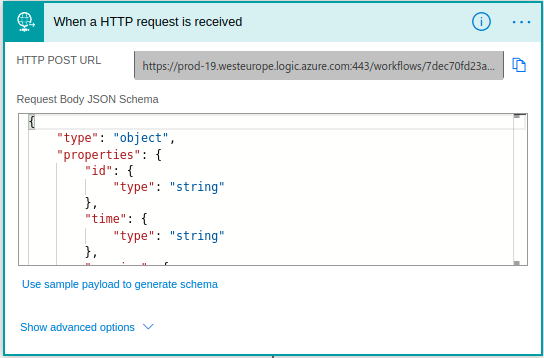

Example: 
`https://prod-19.westeurope.logic.azure.com:443/workflows/7dec70fd23a44bc8ad6d7b14e5ea78ec/triggers/manual/paths/invoke?api-version=2016-06-01&sp=%2Ftriggers%2Fmanual%2Frun&sv=1.0&sig=N8eW1VYHzhGiMB9l4_AohLui0kG1C4JTKR6Zc2kZeFs`

Set `CENTRAL_SUBSCRIPTIONS_APPROVAL_WEBHOOK_URL` to the copied value.

Restart the agent.
