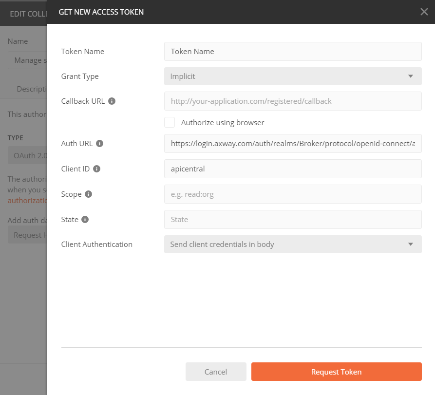
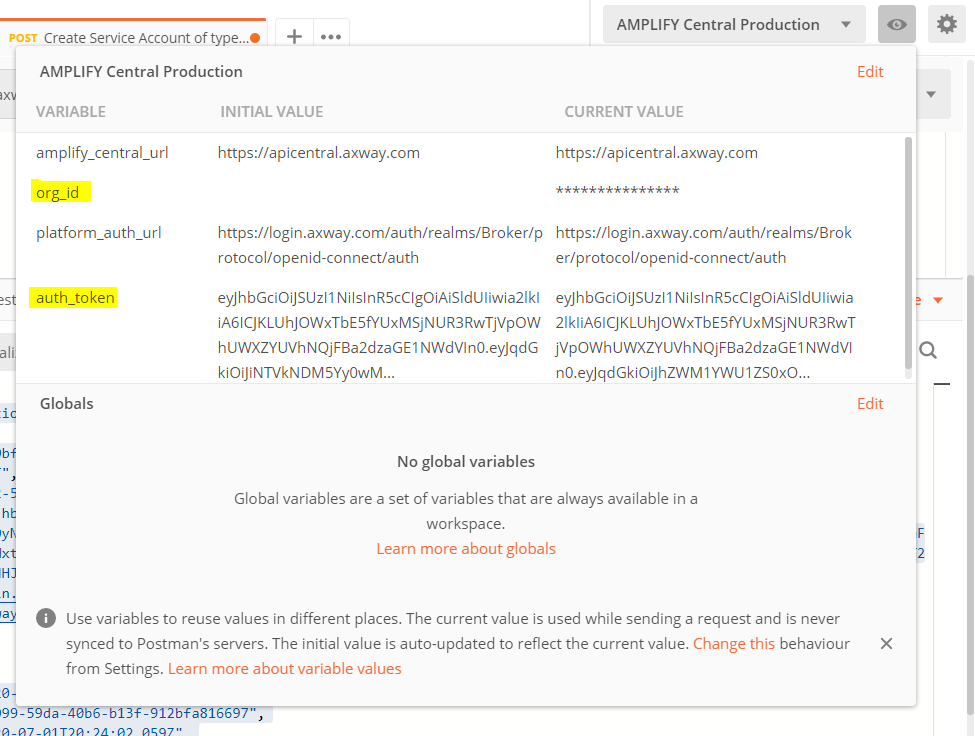
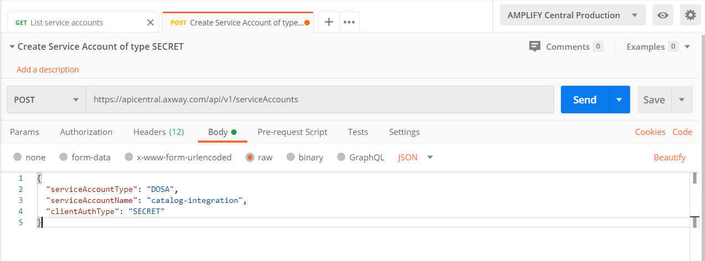
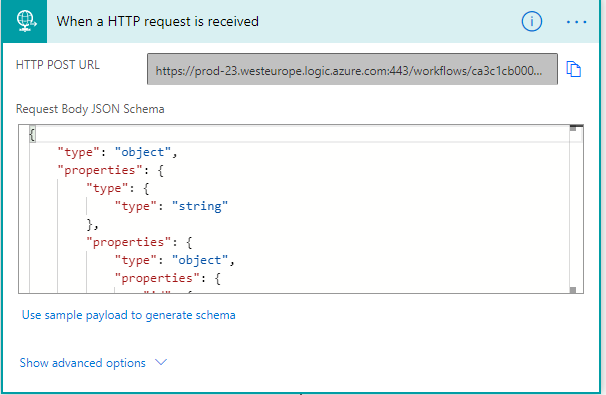
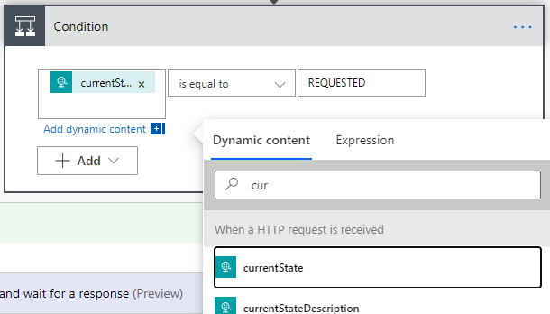
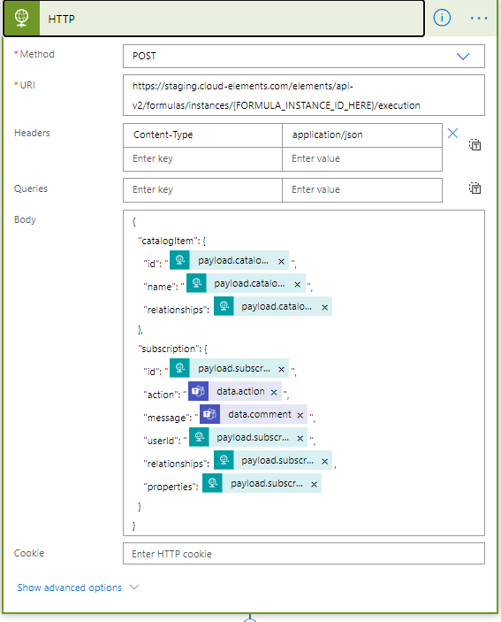
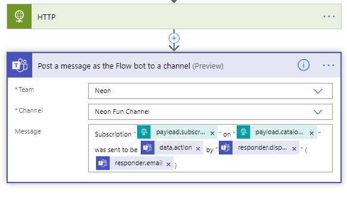
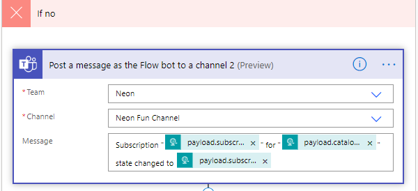
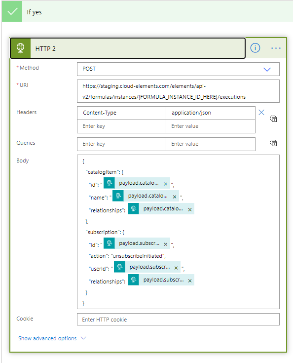
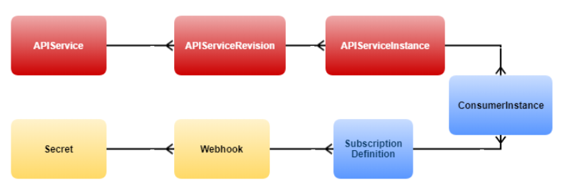

### Discover APIs from CA Layer7 and configure custom approval flows


The basic use case is as follows:

**API Provider**
* Will publish APIs from Layer7 Portal into the Unified Catalog via script.  Those APIs will require manual approval of subscription requests from consumers.
* Is notified in Microsoft Teams when there is a new subscription requests, and will approve or reject the request. 

**API Consumer**
* Discovers the API in the Unified Catalog and request access by subscribing.
* On approval, an Application will be created in Layer7 and the keys will be sent to the API Consumer's email. After the keys have been sent, the state of the Subscription in Unified Catalog gets updated to Active and the Consumer can now use the API with the information received over email. 
* Can cancel the subscription from the Unified Catalog. When cancelled, the subscription in Layer7 will be removed and the state of the Unified Catalog will be updated to unsubscribed, indicating the consumer will no longer be able to use the API. 
  


The technologies that were used for this project: 

* [AMPLIFY Unified Catalog](https://docs.axway.com/bundle/axway-open-docs/page/docs/catalog/index.html) as the central place to publish and discover the APIs. 
* [AMPLIFY Central CLI](https://docs.axway.com/bundle/axway-open-docs/page/docs/central/cli_getstarted/index.html) to fetch the APIs from Layer7 Portal and promote them to the Unified Catalog.
* [Integration Builder](https://www.axway.com/en/products/application-integration) to implement the logic for the subscription management and email notifications. 
* [Microsoft Teams](https://www.microsoft.com/en-us/microsoft-365/microsoft-teams/group-chat-software) for notifications and approval or rejection of subscription requests. 
* [Layer7 Gateway](https://www.broadcom.com/products/software/api-management/layer7-api-gateways) and [Portal](https://techdocs.broadcom.com/us/en/ca-enterprise-software/layer7-api-management/api-developer-portal/4-5.html).


Follow the steps below to use this example: 


### Step 1: Create Amplify Central Service Account

Save the clientId and clientSecret from the response which will be used in Integration Builder flow.

##### Option 1

Make sure you log out from all active sessions. 


```powershell
amplify auth logout --all
```

Go to the AMPLIFY platform, login with an account that is assigned the Administrator platform role, and copy the OrgID. Set the **ORG_ID** in the command below and execute it. 
To run the command, you need to have jq installed. 
```powershell
amplify auth login --client-id apicentral
ORG_ID=<org_id_value> && TOKEN=$(amplify auth list --json | jq -r ".[] | select( .org.org_id == $ORG_ID ) | .tokens.access_token") && curl -vv 'https://apicentral.axway.com/api/v1/serviceAccounts' \
--header "Authorization: Bearer ${TOKEN}" \
--header "X-Axway-Tenant-Id: ${ORG_ID}" \
--header 'Content-Type: application/json' \
--data-raw '{
  "serviceAccountType": "DOSA",
  "serviceAccountName": "IntegrationBuilderSA",
  "clientAuthType": "SECRET"
}'
```

##### Option 2

Use the postman **[collection](https://github.com/Axway/unified-catalog-integrations/blob/axwayTokenFromSA/utils/postman)**. 

1. Import the [Manage service accounts.postman_collection.json](https://github.com/Axway/unified-catalog-integrations/blob/axwayTokenFromSA/utils/postman/Manage%20service%20accounts.postman_collection.json) collection in Postman. 

2. Import the [AMPLFY Environment configuration file](https://github.com/Axway/unified-catalog-integrations/blob/axwayTokenFromSA/utils/postman/AMPLIFY%20Central%20Production.postman_environment.json) in Postman. 

3. For authentication, the APIs require OAuth2 implicit. To authenticate, go to Postman Collection, click on the "..." button and then select _Edit_. 


 
4. From the new screen, go to _Authorization_ and click on _Get New Access Token_. To authenticate use: 
* Grant Type: `Implicit`
* Auth URL:`https://login.axway.com/auth/realms/Broker/protocol/openid-connect/auth?idpHint=360`
* Client ID: `apicentral`



Copy the access token. You will use this to set the AMPLIFY Central Production environment variables. 

5. Set the AMPLIFY Central Production environment variables. From the top right corner, select the _AMPLIFY Central Production_ environment from the dropdown, and then click on the eye button next to the dropdown. 
* Set the CURRENT VALUE for the **org_id**: Go to the AMPLIFY platform, login with an account that is assigned the Administrator platform role, and copy the OrgID. 
* Set the CURRENT VALUE for the **auth_token**: Copy and paste the access token from the previous step.  




6. Run the **Create Service Account of type SECRET** POST request. In the body payload, you could change the `serviceAccountName` to a value of your choice. 

 

Save the **clientId** and **clientSecret** from the response which will be used in Integration Builder flow. Below is an example of the response body. 

```json
{
  "name": "amplify-integration",
  "type": "DOSA",
  "clientId": "DOSA_f0c4b70**********",
  "clientAuthType": "SECRET",
  "clientSecret": "07b*************",
  "registrationToken": "eyJhbGciOiJIUzI1NiIsInR5cCIgOiAiSldUIiwia2lkIiA6ICI3NjE5OGUwZS1lNTcz******",
  "tokenUrl": "https://login.axway.com/auth/realms/Broker/protocol/openid-connect/token",
  "aud": "https://login.axway.com/auth",
  "realm": "Broker",
  "certificate": {},
  "metadata": {
    "createTimestamp": "2020-07-01T20:24:02.059Z",
    "createUserId": "e1add099-59da-40b6-b13f-912bfa816697",
    "modifyTimestamp": "2020-07-01T20:24:02.059Z",
    "modifyUserId": "e1add099-59da-40b6-b13f-912bfa816697"
  }
}
```

### Step 2: Layer7 Portal configuration
***

1. Expose Layer7 Portal APIs in Layer7 Gateway


2. Create an Application and link it to the Portal APIs


Save your **Client ID** and **Shared Secret** as those will be used in discovering the APIs and in the Subscription flows.


### Step 3: Configure Integration Builder flow to update subscriptions and send email notifications
***

This Integration Builder flow will receive the approve or reject requests from Microsoft Teams and unsubscribe requests from Unified Catalog, then will subscribe / unsubscribe the consumer to the APIs in Layer7 Portal and updates the Subscription states in Unified Catalog.. It will also send email notifications to the user with the key to authenticate the API calls.

Flow these steps to configure the flow: 
1. Download the [Layer7 Registration Flow.json](./assets/integration-builder/subscriptionflow.json). 
2. Navigate to [Integration Builder](https://sandbox-ib.platform.axway.com/welcome) on the [AMPLIFY Platform](https://platform.axway.com/).  
3. Import the flow as a **Flow template**. 
   * Go to `Flows`, click on `Build New Flow`. 
   * Select `Import` and choose the flow that you downloaded in the previous step.  
   * Provide a `Name` and click on `Create' to save your flow template. 
4. Configure a **Connector instance** to send email notifications to Outlook. 
   * From `Connectors`, search for `Outlook Email` connector in the search box.
   * Select the `Outlook Email` connector and click `Authenticate`. 
   * Provide a `Name` and click on `Create instance`. You will be redirected to authenticate with your Outlook credentials.
   * Go to `Instances` and look for the connector instance that you just created. 
5. Create a **flow instance** to replace the Value variables in the template with specific values to connect to your Layer7 Portal environment and platform tenant.
* Navigate to `Flows`, select your flow template and click `Create Instance'. 
* Provide a `Name` for the instance. 
* Select the `outlookEmail` connector instance that you created at Step 4. 
* Provide values for all required Variables:
  * `axwayClientId`: The `clientId` from Axway Service Account. Please refer to _Step 1: Create Amplify Central Service Account_.
  * `axwayClientSecret`: The `clientSecret` from Axway Service Account. Please refer to _Step 1: Create Amplify Central Service Account_.
  * `axwayTenantId`: The organization id of your AMPLIFY account.
  * `layer7ClientId`: The Layer7 Client ID from your Layer7 Application configured to access the Layer7 Portal APIs. 
  * `layer7ClientScope`: The scope configured in the Layer7 Application, `OOB` in the provided example.
  * `layer7ClientSecret`: The Client Secret from your Layer7 Application configured to access the Layer7 Portal APIs.
  * `layer7PortalUrl`: The URL where the Layer Portal APIs are exposed.
  * `layer7SubscriptionsOrgId`: The Layer 7 Organization ID where subscriptions the Consumer Application will be created.
  * `apiCentralUrl`: Optional parameter to configure access to AMPLIFY Central APIs. Defaults to `https://apicentral.axway.com`. For AMPLIFY Central EU deployment, use `https://central.eu-fr.axway.com`

### Step 4: Configure Microsoft Teams flow to Approve / Reject subscription requests
***

**AMPLIFY Central Unified Catalog** has the option to configure Webhooks that can be invoked when Consumers of Catalog asset update their subscriptions.
This flow will send notifications to MS teams channel as an Active card when a consumer subscribes to the API from the Unified Catalog. 
The API provider can then approve or reject the subscription requests from within the MS Active card. This action will trigger the Integration Builder flow, as a post execution step. 
The MS flow will also post notifications in the channel for any subscription updates. 


**Pre-requisite:** 
* You'll need [Microsoft Flow](https://flow.microsoft.com), with a Free Trial account at a minimum to be able to create the flow. 

**To configure the flow:**

1. Navigate to [Microsoft Flow](https://flow.microsoft.com).
2. Create the Webhook entry point that Unified Catalog will send the events to. 
    * Go to "My flows". 
    * Create an `Instant flow`, provide a `name` and select `When an HTTP request is received` as an entry point.
    * In the request json body schema, copy and paste the Subscription Updated Event schema below: 

```json
{
        "type": "object",
        "properties": {
            "id": {
                "type": "string"
            },
            "time": {
                "type": "string"
            },
            "version": {
                "type": "string"
            },
            "product": {
                "type": "string"
            },
            "correlationId": {
                "type": "string"
            },
            "organization": {
                "type": "object",
                "properties": {
                    "id": {
                        "type": "string"
                    }
                }
            },
            "type": {
                "type": "string"
            },
            "payload": {
                "type": "object",
                "properties": {
                    "consumerInstance": {
                        "type": "object",
                        "properties": {
                            "kind": {
                                "type": "string"
                            },
                            "name": {
                                "type": "string"
                            },
                            "tags": {
                                "type": "array",
                                "items": {
                                    "type": "string"
                                }
                            },
                            "group": {
                                "type": "string"
                            },
                            "metadata": {
                                "type": "object",
                                "properties": {
                                    "id": {
                                        "type": "string"
                                    },
                                    "audit": {
                                        "type": "object",
                                        "properties": {
                                            "createUserId": {
                                                "type": "string"
                                            },
                                            "modifyUserId": {
                                                "type": "string"
                                            },
                                            "createTimestamp": {
                                                "type": "string"
                                            },
                                            "modifyTimestamp": {
                                                "type": "string"
                                            }
                                        }
                                    },
                                    "scope": {
                                        "type": "object",
                                        "properties": {
                                            "id": {
                                                "type": "string"
                                            },
                                            "kind": {
                                                "type": "string"
                                            },
                                            "name": {
                                                "type": "string"
                                            }
                                        }
                                    },
                                    "references": {
                                        "type": "array",
                                        "items": {
                                            "type": "object",
                                            "properties": {
                                                "id": {
                                                    "type": "string"
                                                },
                                                "kind": {
                                                    "type": "string"
                                                },
                                                "name": {
                                                    "type": "string"
                                                },
                                                "type": {
                                                    "type": "string"
                                                }
                                            },
                                            "required": [
                                                "id",
                                                "kind",
                                                "name",
                                                "type"
                                            ]
                                        }
                                    },
                                    "resourceVersion": {
                                        "type": "string"
                                    }
                                }
                            },
                            "apiVersion": {
                                "type": "string"
                            },
                            "attributes": {
                                "type": "object",
                                "properties": {
                                    "release": {
                                        "type": "string"
                                    }
                                }
                            }
                        }
                    },
                    "subscription": {
                        "type": "object",
                        "properties": {
                            "id": {
                                "type": "string"
                            },
                            "name": {
                                "type": "string"
                            },
                            "userId": {
                                "type": "string"
                            },
                            "properties": {
                                "type": "object",
                                "additionalProperties": true
                            },
                            "metadata": {
                                "type": "object",
                                "properties": {
                                    "createUserId": {
                                        "type": "string"
                                    }
                                }
                            },
                            "currentState": {
                                "type": "string"
                            },
                            "owningTeamId": {
                                "type": "string"
                            },
                            "relationships": {
                                "type": "array",
                                "items": {
                                    "type": "object",
                                    "properties": {
                                        "key": {
                                            "type": "string"
                                        },
                                        "path": {
                                            "type": "string"
                                        },
                                        "spec": {
                                            "type": "string"
                                        },
                                        "type": {
                                            "type": "string"
                                        },
                                        "value": {
                                            "type": "string"
                                        }
                                    },
                                    "required": [
                                        "key",
                                        "path",
                                        "spec",
                                        "type",
                                        "value"
                                    ]
                                }
                            },
                            "nextPossibleStates": {
                                "type": "array"
                            },
                            "currentStateDescription": {
                                "type": "string"
                            }
                        }
                    },
                    "catalogItem": {
                        "type": "object",
                        "properties": {
                            "id": {
                                "type": "string"
                            },
                            "name": {
                                "type": "string"
                            },
                            "owningTeamId": {
                                "type": "string"
                            },
                            "relationships": {
                                "type": "array",
                                "items": {
                                    "type": "object",
                                    "properties": {
                                        "key": {
                                            "type": "string"
                                        },
                                        "path": {
                                            "type": "string"
                                        },
                                        "spec": {
                                            "type": "string"
                                        },
                                        "type": {
                                            "type": "string"
                                        },
                                        "value": {
                                            "type": "string"
                                        }
                                    },
                                    "required": [
                                        "key",
                                        "path",
                                        "spec",
                                        "type",
                                        "value"
                                    ]
                                }
                            }
                        }
                    }
                }
            }
        }
    }
```



3. Add an extra step of type `Control`, action type `Condition`. 
   * Set the the value for the `Condition`, by searching `currentState` using the `Add dynamic content`. 
   * Set the operator to `is equal to` and value set to `REQUESTED`.



4. Set up the Adaptive card. The subscription requests will be Approved or Rejected based on the response of the action in the Adaptive Card. 
   * On the `If yes` branch, select `Add a new action` of type `Post an Adaptive Card to a Teams channel and wait for the response`.
   * Configure the `Team` and the `Channel` where the card would be posted.
   * Copy-paste the text below in `Message` box: 

 ```json
    {
        "$schema": "http://adaptivecards.io/schemas/adaptive-card.json",
        "type": "AdaptiveCard",
        "version": "1.0",
        "body": [
            {
                "type": "Container",
                "items": [
                    
                    {
                        "type": "TextBlock",
                        "text": "Subscription requested",
                        "weight": "Bolder",
                        "size": "Medium"
                    },
                    {
                        "type":"Image",
                        "url":"https://upload.wikimedia.org/wikipedia/commons/5/5a/Axway_Logo.png",
                        "spacing": "Small",
                        "horizontalAlignment": "Center",
                        "height": "stretch",
                        "size": "Medium"
                    }
                ]
            },
            {
                "type": "Container",
                "style": "accent",
                "items": [
                    {
                        "type": "FactSet",
                        "facts": [
                            {
                                "title": "Catalog Item",
                                "value": "@{triggerBody()?['payload']?['catalogItem']?['name']}"
                            },
                            {
                                "title": "Subscription",
                                "value": "@{triggerBody()?['payload']?['subscription']?['name']}"
                            },
                            {
                                "title": "Message",
                                "value": "@{triggerBody()?['payload']?['subscription']?['currentStateDescription']}"
                            }
                        ]
                    }
                ]
            },
            {
                "type": "TextBlock",
                "text": "Select your action:",
                "weight": "Bolder",
                "wrap": true
            },
            {
                "type": "Input.ChoiceSet",
                "placeholder": "Enter your action",
                "id": "action",
                "choices": [
                    {
                        "title": "Approve",
                        "value": "approved"
                    },
                    {
                        "title": "Reject",
                        "value": "rejected"
                    }
                ],
                "style": "expanded"
            }
        ],
        "actions": [
            {
                "type": "Action.ShowCard",
                "title": "Submit",
                "card": {
                    "type": "AdaptiveCard",
                    "body": [
                        {
                            "type": "Input.Text",
                            "id": "comment",
                            "isMultiline": true,
                            "placeholder": "Enter your comment"
                        }
                    ],
                    "actions": [
                        {
                            "type": "Action.Submit",
                            "title": "OK"
                        }
                    ],
                    "$schema": "http://adaptivecards.io/schemas/adaptive-card.json"
                }
            },
            {
                "type": "Action.OpenUrl",
                "title": "Team details",
                "url": "https://apicentral.axway.com/access/teams/detail/@{triggerBody()?['payload']?['subscription']?['owningTeamId']}"
            },
            {
                "type": "Action.OpenUrl",
                "title": "User details",
                "url": "https://platform.axway.com/#/user/@{triggerBody()?['payload']?['subscription']?['metadata']?['createUserId']}"
            },
            {
                "type": "Action.OpenUrl",
                "title": "View Subscription in Unified Catalog",
                "url": "https://apicentral.axway.com/catalog/@{triggerBody()?['payload']?['catalogItem']?['id']}/subscriptions/@{triggerBody()?['payload']?['subscription']?['id']}"
            }
        ],
        "minHeight": "100px"
    }
 ```

   * Set the `Update Message` to: 
 ```js
Subscription "@{triggerBody()?['payload']?['subscription']?['name']}" processed for "@{triggerBody()?['payload']?['catalogItem']?['name']}"
```
   * Set the `Should update card` to `yes`.


5. Add an action of type `HTTP` to configure calling to Integration Builder

   * Set `Method`to `POST`
   * Set `URI`to `https://staging.cloud-elements.com/elements/api-v2/formulas/instances/{FLOW_INSTANCE_ID_HERE}/executions`. Please make sure to replace {FLOW_INSTANCE_ID_HERE} with the Flow Instance ID created at Step 3: Configure Integration Builder flow to update subscriptions and send email notifications. 
   * Set `Headers`to `Content-Type: application/json`<p/>
   * Set the `Body`to
    
    ```js
    {
        "catalogItem": {
            "id": "@{triggerBody()?['payload']?['catalogItem']?['id']}",
            "name": "@{triggerBody()?['payload']?['catalogItem']?['name']}",
            "relationships": @{triggerBody()?['payload']?['catalogItem']?['relationships']}
        },
        "subscription": {
            "id": "@{triggerBody()?['payload']?['subscription']?['id']}",
            "action": "@{body('Post_an_Adaptive_Card_to_a_Teams_channel_and_wait_for_a_response')?['data']?['action']}",
            "message": "@{body('Post_an_Adaptive_Card_to_a_Teams_channel_and_wait_for_a_response')?['data']?['comment']}",
            "userId": "@{triggerBody()?['payload']?['subscription']?['metadata']?['createUserId']}",
            "relationships": @{triggerBody()?['payload']?['subscription']?['relationships']},
            "properties": @{triggerBody()?['payload']?['subscription']?['properties']}
        }
    }
    ```
    
    * Click on `Show advanced options` and set `Authorization` to `Raw`, value being your Integration Builder User and Org secrets: `User ****, Organization ****`



6. Add a new Microsoft Teams action as `Post a message as the Flow bot to a channel`. 
   * Select the `Team` and the `Channel`
   * Set the `Message` field to:

    ```js
    Subscription "@{triggerBody()?['payload']?['subscription']?['name']}" on "@{triggerBody()?['payload']?['catalogItem']?['name']}" was sent to be @{body('Post_an_Adaptive_Card_to_a_Teams_channel_and_wait_for_a_response')?['data']?['action']} by "@{body('Post_an_Adaptive_Card_to_a_Teams_channel_and_wait_for_a_response')?['responder']?['displayName']}" (@{body('Post_an_Adaptive_Card_to_a_Teams_channel_and_wait_for_a_response')?['responder']?['email']})
    ```



7. Set up the `If no` branch.
    The flow will always post a message to a teams channel when a subscription state changes and the current state is different than `REQUESTED`.
    * Select `Post a message as the Flow bot to a channel` action. 
    * Pick the `Team` and `Channel`
    * Set the `Message` field to:

    ```js
    Subscription "@{triggerBody()?['payload']?['subscription']?['name']}" for "@{triggerBody()?['payload']?['catalogItem']?['name']}" state changed to @{triggerBody()?['payload']?['subscription']?['currentState']}
    ```



8. Add a `Control`, `Condition` action. 
   * Set the the value for the `Condition` to `currentState`
   * Set the operator to `is equal to` and value set to `UNSUBSCRIBE_INITIATED`.
   
 

9. On the `If yes` branch, send the event data to Integration Builder.
   * Select a `HTTP` action. 
   * Set the `Method` to `POST`
   * Set the `URI` to `https://staging.cloud-elements.com/elements/api-v2/formulas/instances/{FLOW_INSTANCE_ID_HERE}/executions`. Please make sure to replace {FLOW_INSTANCE_ID_HERE} with the Flow Instance ID created at Step 3: Configure Integration Builder flow to update subscriptions and send email notifications. 
   * Set the `Headers` to `Content-Type: application/json`
   * Set the `Body`to:
    
    ```js
    {
        "catalogItem": {
            "id": "@{triggerBody()?['payload']?['catalogItem']?['id']}",
            "name": "@{triggerBody()?['payload']?['catalogItem']?['name']}",
            "relationships": @{triggerBody()?['payload']?['catalogItem']?['relationships']}
        },
        "subscription": {
            "id": "@{triggerBody()?['payload']?['subscription']?['id']}",
            "action": "unsubscribeInitiated",
            "userId": "@{triggerBody()?['payload']?['subscription']?['metadata']?['createUserId']}",
            "relationships": @{triggerBody()?['payload']?['subscription']?['relationships']}
        }
    }
    ```
    * Click on `Show advanced options` and set `Authorization` to `Raw`, value being your Integration Builder User and Org secrets: `User ****, Organization ****`



10. Save the flow


### Step 5: Install and configure the @axway/amplify-central-layer7-extension 
___

CLI extension that fetches the APIs from Layer7 Portal and builds the resources needed to publish to the AMPLIFY Unified Catalog.  The following set of resources were configured. 

* **Environment** groups the set of APIs that are fetched from Layer7 Portal. An environment represents the logical grouping of APIs. 
* **Webhook** defines the webhook URL that will be invoked to post a notification in Microsoft Teams and update the subscription in Layer7.
* **Secret** provides key value pairs of named secrets that are used to secure your webhooks. Setting a webhook secret allows you to ensure that POST requests sent to the payload URL are from Axway. 
* **ConsumerSubscriptionDefinition** allows the configuration of the data needed from a consumer to subscribe to the API from the Unified Catalog.  It also has a reference to the webhook that will get invoked on subscription, and it is referenced in the ConsumerInstance resources. 
* **APIService** holds all the information needed to represent your API (image, description, markdown documentation etc). 
* **APIServiceRevision** holds the OAS specification file. Multiple revisions can be created. 
* **APIServiceInstance** contains the endpoints (host and port information) where the API is deployed.
* **ConsumerInstance**  contains all the details for creating the asset in the Unified Catalog. It also contains a reference to the ConsumerSubscriptionDefinition that has the link to the webhook. That means that for each Subscription Update event generated from Unified Catalog related to the Catalog Item created from the ConsumerInstance, the webhook will get invoked

The above resources structure map to the API Server REST API resources as defined in the API Server [OAS3 specs](https://apicentral.axway.com/apis/docs).



Before you proceed, you can check the full list of supported commands [here](./layer7-extension/README.md).

**1. Install @axway/layer7-extension**

Assuming you are familiar with [Node.js](https://nodejs.org) and [npm](https://npmjs.com), you should first install the [Axway AMPLIFY CLI](https://www.npmjs.com/package/@axway/amplify-cli), which will give you connectivity to the [Axway AMPLIFY Platform](https://www.axway.com/en/products/amplify). Note that you must first have an account on [https://platform.axway.com](https://platform.axway.com/), and be provisioned in AMPLIFY Central. 

```powershell
[sudo] npm install -g @axway/amplify-cli
```

Use the AMPLIFY package manager command to install the AMPLIFY Central CLI:

```powershell
amplify pm install @axway/amplify-central-cli
```

You can then install the @axway/amplify-central-layer7-extension:

```powershell
npm install @axway/amplify-central-layer7-extension
```

The installation would present the command to add this extension to the AMPLIFY Central CLI following this template:

```powershell
amplify central config set extensions.layer7-extension <path to where you installed the extension>
```

To verify if the CLI extension was successfully set, you can run: `amplify central layer7-extension config -h`.

**2. Configure extension**

Configure the extension prior to generating the resources. 
You must be logged into the Axway AMPLIFY Platform before uploading any generated resource files. 
You'll can use your platform account or setup a Service Account (DOSA). To find out how to create a Service Account, visit [Get started with AMPLIFY CLI](https://docs.axway.com/bundle/axway-open-docs/page/docs/central/cli_getstarted/index.html). 

* Log in to the [Axway AMPLIFY Platform](https://www.axway.com/en/products/amplify) using DOSA account using the following command:
```powershell
amplify auth login --client-id <DOSA Service Account> --secret-file <private_key_for_service_account>
```
Example: `amplify auth login --client-id DOSA_105cf15d051c432c8cd2e1313f54c2da --secret-file ~/test/private_key.pem`
 
* Set the output directory where you want the resources to be generated. 
```powershell
amplify central layer7-extension config set --output-dir=<directory_name>
```
Example: `amplify central layer7-extension config set --output-dir="./layer7-resources"`.

* Set the environment name: 
```powershell
amplify central layer7-extension config set --environment-name=<env_name>
```
Example: `amplify central layer7-extension config set --environment-name=layer7-env`

* Set the image for the environment
```powershell
amplify central layer7-extension config set --icon=<path_to_your_image>
```

* Set the Webhook URL to send the HTTP POST request for a subscription update event.
```powershell
amplify central layer7-extension config set --webhook-url="MS_FLOW_HTTP_POST_URL"
```

* Set the Layer7 Client Id from the Layer7 Application linked to the Portal APIs.

```powershell
amplify central layer7-extension config set --client-id=<your_layer7_client_id>
```
  
* Set the Layer7 Client Secret from the Layer7 Application linked to the Portal APIs
```powershell
amplify central layer7-extension config set --client-secret=<your_layer7_client_secret>
```

* Set the Layer7 Portal APIs base URL for where the Layer7 Portal APIs are exposed.
```powershell
amplify central layer7-extension config set --base-url=<your_layer7_portal_url>
```
Example: `amplify central layer7-extension config set --base-url="https://apim-ssg.dev.com:9443/apim"`.

 You can run `amplify central layer7-extension config list` to see the layer7-extension configuration.  
 
**3. Generate AMPLIFY Central resources**`

The generate command will create AMPLIFY Central resource files for your configured Layer7 APIs instance. 
These files will be generated into either `./resources` or the directory you configured with the `--output-dir` configuration setting. 

```
amplify central layer7-extension resources generate
```

**4. Publish to Unified Catalog**

After generating these files you can modify and upload them to AMPLIFY Central with the `amplify central create -f=<file>` command. You'll want be sure to upload any Environment files before other generated resources.

Create the Environment in AMPLIFY Central.

```powershell
# Upload the Environment, Webhook, and ConsumerSubscriptionDefinition
amplify central create --file=<path_to_environment_file>
```
Import the APIs in AMPLIFY Central and publish them to the Unified Catalog. You need to run this command for each _service_yaml_ file. 

```powershell
# Upload the APIService, APIServiceRevision, APIServiceInstance, and ConsumerInstance
amplify central create -f=~<path_to_service_yaml_file>
```

**Example**

```powershell
# Upload the Environment, Webhook, and ConsumerSubscriptionDefinition
amplify central create -f=~/Desktop/Environment.yaml
# Upload the APIService, APIServiceRevision, APIServiceInstance, and ConsumerInstance
amplify central create -f=~/Desktop/APIService-swagger-petstore.yaml
```

For full list of supported commands, please refer to [here](./layer7-extension/README.md). 

